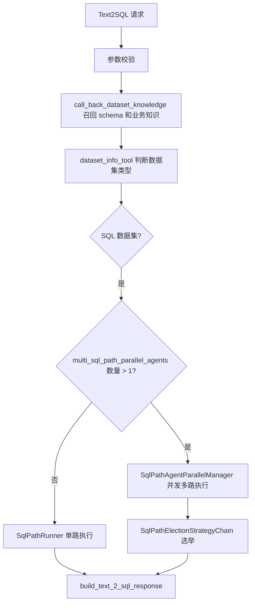

# Text2SQL SQL 多路生成、校验、纠错与选举详解

本文聚焦非 DSL 的 SQL 数据集路径，说明 Text2SQL 在多路并发配置下如何生成 SQL、执行校验、失败纠错以及最终选举。这里的“多路”不是把同一条 SQL 执行多次，而是让多个 SQL 路径各自完整走一遍 `生成 SQL -> 执行 SQL -> 必要时纠错 -> 再执行`，最后把各路径的 `PathState` 交给选举策略链裁决。

## 1. 触发条件与入口

SQL 多路能力由 LAF 配置 `multi_sql_path_parallel_agents` 控制，代码入口在 `modules/agents/text_2_sql_agents/scene/ge_c_query_analysis/ge_c_query_analysis_agent.py` 和 `modules/agents/text_2_sql_agents/scene/common/text_2_sql_see_query.py`。当该配置返回的 Agent 数量大于 1 时，workflow 会创建 `SqlPathAgentParallelManager`，否则直接使用单路 `SqlPathRunner`。因此，多路不是所有请求默认发生，而是取决于运行时配置。

在进入多路之前，入口 Agent 已经完成了参数转换、参数校验、数据集知识召回和数据集类型判断。也就是说，传给每一路 SQL Agent 的核心输入是同一份 `Text2SQLRequest` 和同一份 `DatasetKnowledge`，其中包含用户 query、bookId、erp、数据集 schema、字段枚举、字段是否聚合属性 `is_agg`、业务知识等信息。



## 2. 多路并发如何启动

`SqlPathAgentParallelManager.run_and_elect()` 会先生成一个 `parallel_id`，再通过 `asyncio.gather()` 同时调用配置中的每个 Agent 名称。每个 Agent 收到的 arguments 一致：`text_2_sql_request`、`dataset_knowledge`、`custom_aop_config_dict` 和 `asyncio_instance_lock`。其中 `asyncio_instance_lock` 主要用于交互式场景中控制流式消息发送顺序，不改变 SQL 生成本身。

多路执行的关键点是：选举一定发生在所有路径都返回之后。`asyncio.gather()` 会等待每一路完成；随后 manager 把每个返回结果转换成 `PathState`，补回原始 request 和 dataset knowledge，再调用 `invoke_sql_path_election_strategy_agent()`。这意味着某一路如果较慢，会拖住最终选举；某一路失败也不会立即结束整体流程，除非异常没有被路径内部捕获。

```text
SqlPathAgentParallelManager.run_and_elect()
    -> asyncio.gather(single_path_sql_agent, single_path_sql_agent, ...)
        -> 每一路独立生成 SQL
        -> 每一路独立执行 SQL
        -> 每一路按需纠错并重查
    -> 收集所有 PathState
    -> invoke_sql_path_election_strategy_agent()
    -> 返回最终 ConsensusDecision.path_state
```

## 3. 单条 SQL 路径内部做了什么

每一路最终都会进入 `single_path_sql_agent_func_workflow()`，再创建 `SqlPathRunner`。`SqlPathRunner.run()` 是单条 SQL 路径的核心，它先调用 `llm_dataset_sql_agent` 生成 SQL，再调用 `query_dataset_data_tool` 执行 SQL，并根据执行结果决定是否纠错。

SQL 生成阶段依赖 `llm_dataset_sql_prompt`。代码会在调用模型前注入 `prompt_query`、`prompt_dataset_name`、`prompt_dataset_schema`、`prompt_dataset_business_knowledge`、`prompt_date` 和 `prompt_date_week`。Prompt 明确要求模型只使用声明过的表名和字段名、禁止 `SELECT *`、日期范围要显式推导、聚合属性字段必须用 `AGG()`、基础字段才使用 `SUM/COUNT/AVG` 等常规聚合，并且在最终阶段输出 JSON，包含 `think-process` 和 `sql`。如果用户诉求里明确出现农历日期，模型可以先输出 `convert_calendar` 工具调用；否则应直接输出最终 SQL JSON。

代码侧不会盲信 prompt 输出。`llm_dataset_sql_agent_func_parse_llm_response()` 会检查模型输出是否是 JSON，如果是工具调用就进入工具流程；如果是最终答案，就提取 `think-process`、`clarification-process`、`sql-self-check` 和 `sql`，并用 `sqlparse` 格式化 SQL。随后它做三类基础校验：SQL 必须存在，必须包含 `from`，必须包含当前数据集表名。如果数据集 schema 中存在 `is_agg=1` 的聚合属性字段，还会调用 `is_fully_column_agg()` 检查这些字段是否被 `AGG()` 等聚合方式正确包裹；不满足时会触发一次聚合规则提示重试。这里需要注意，`sql-self-check` 会被保存进 `llm_sql_info`，但当前代码没有把它当作独立评分器使用。

SQL 执行阶段由 `invoke_query_dataset_data_tool()` 组装请求体，传入 query、bookId、dataSetId、dataSetName、dataSetSchema、erp 和模型生成的 SQL。`dataSetSchema` 会把字段原始名、展示名、字段类型、枚举值和 `isAgg` 一起传给远程执行服务。工具最终调用 `query_dataset_data_tool`，由 `dataset_data_query_service_ds.py` 请求远程 `executeSqlAntlr4`。执行成功时，远程返回 header code 为 `0`，数据被包装成 `UnifiedResponse.success()`；执行失败时，会把 JSF header 的 msg 和 extraMsg 包装进 `UnifiedResponse.fail()`，供后续纠错使用。

## 4. 失败后如何纠错和重试

纠错触发点在 `SqlPathRunner.is_correction_needed()`。它先调用 `is_sql_correction_needed()` 判断是否值得纠错：如果执行结果 header code 为 `0`，说明已经成功，不会纠错；如果错误被诊断为“内存”或“超时”，也不会交给 LLM 纠错，因为这类问题通常不是改几个字段名就能解决；其他执行失败通常会进入纠错。

在调用 LLM 纠错前，系统先尝试工程规则修复 `MissingQuoteSQLCorrection`。这个规则只处理非常窄的场景，例如 ClickHouse 报 `Missing quote: '`，并且 SQL 末尾疑似把单引号写成了反引号，此时直接改 SQL 字符串并重新执行。如果这个工程修复成功且重新执行通过，该路径就不会再调用 LLM 纠错。

如果工程修复后仍然失败，才进入 `DynamicSQLCorrection`，也就是调用 `llm_dataset_sql_correction_agent`。纠错 prompt 会复用 SQL 生成 prompt 的上下文，并额外注入 `prompt_bad_sql` 和 `prompt_sql_error_msg`。它的职责不是重新做一轮开放式分析，而是在用户诉求、schema、业务知识、bad SQL 和数据库错误之间定位最小修复点，例如字段名错误、日期类型错误、聚合位置错误、别名引用错误等。`llm_dataset_sql_correction_agent` 注册时 `max_react_rounds=1`，外层 `StatefulRetryExecutor(0, 0)` 的 `max_retries=0`，所以当前实现只执行一次动态纠错函数，不会在同一路径中无限重试。

纠错后的 SQL 会再次通过 `query_dataset_data_tool` 请求远程执行服务。最终 `PathState.is_success` 只看最后一次 `dataset_data.header.code == 0`，`PathState.llm_sql_info["sql"]` 会被更新成纠错后的 SQL。

## 5. 选举前的数据如何被裁剪

进入选举前，`invoke_sql_path_election_strategy_agent()` 会复制每个 `PathState`。失败路径的 `exec_result` 会被置空，成功路径只保留最多前 5 行数据，并把原始数据量记录到 `extra.data_size`。这样做是为了降低选举 prompt 的 token 消耗，同时避免把完整结果集塞给 LLM。最终被返回的 `ConsensusDecision.path_state` 会再映射回原始完整 `PathState`，所以业务返回仍然使用完整执行结果。

选举 prompt 的输入不是只有 SQL，还包括当前日期、用户诉求、表名、字段说明、业务知识，以及每个候选方案的 SQL 和样例结果。`build_dataset_election_prompt()` 会按如下形态拼装每个候选：

```text
## 候选方案(id=路径ID)
### SQL语句
候选 SQL
###执行结果（仅展示前N行，共M行）
| 字段1 | 字段2 | ... |
|------|------|-----|
| ...  | ...  | ... |
```

## 6. 选举策略链的顺序

SQL 多路选举不是直接把所有候选交给 LLM。默认 `SqlPathElectionStrategyChain` 的顺序是 `LogicSqlPathPreElectionStrategy -> LogicSqlPathAggElectionStrategy -> LlmSqlPathElectionStrategy -> LogicSqlPathElectionStrategy`。每一层如果把候选缩到 1 条，就直接结束。

| 顺序 | 策略 | 作用 | 结果 |
| -- | -- | -- | -- |
| 1 | `LogicSqlPathPreElectionStrategy` | 先过滤 `is_success=True` 的路径 | 如果没有成功路径，兜底返回第一条失败路径；如果只剩 1 条成功路径，直接选中 |
| 2 | `LogicSqlPathAggElectionStrategy` | 当数据集存在 `isAgg=1` 字段时，过滤没有正确使用聚合属性字段的 SQL | 如果过滤后有结果，就保留合规路径；否则不强行清空 |
| 3 | `LlmSqlPathElectionStrategy` | 多条成功且规则层无法唯一选择时，调用 `llm_dataset_sql_election_agent` | LLM 根据 SQL 和前 5 行结果输出 `<id>...</id>` |
| 4 | `LogicSqlPathElectionStrategy` | LLM 未能唯一选择或解析失败时的兜底 | 优先返回有数据的第一条，否则返回第一条 |

`llm_dataset_sql_election_prompt` 的角色是“NL2SQL 评估专家与高级数据分析师”，它关注的是候选 SQL 是否最准确、最直接回答用户问题。Prompt 会再次强调日期推导和 `AGG()` 规则，因此它不仅看查询是否有数据，也会比较时间范围、分组粒度、指标口径和聚合规范。它的输出协议很窄，只需要把最终路径 id 放进 `<id>` 标签；解析器只提取这个 id，不读取长篇解释作为结构化结果。

## 7. 结合例子看完整流程

以请求“上月各事业部的采购亏损金额分布及同比变化情况”为例，假设召回的数据集 schema 中存在字段 `日期`、`事业部`、`采购亏损金额`，并且 `采购亏损金额` 是 `isAgg=1` 的聚合属性指标。进入 SQL 路径后，SQL 生成 prompt 会约束模型先推导“上月”和“去年同期上月”的日期区间，再按 `事业部` 分组计算本期和同期采购亏损金额，最后计算同比变化。由于 `采购亏损金额` 是聚合属性字段，正确 SQL 应使用 `AGG(\`采购亏损金额\`)`，不能直接 `SUM(\`采购亏损金额\`)`，也不能把它放进 `CASE WHEN` 里做条件聚合。

在三路并发时，可能出现这样的候选状态。路径 A 生成了两个 CTE：一个查上月各事业部 `AGG(\`采购亏损金额\`)`，另一个查去年同期，再按事业部 join 计算同比；执行成功。路径 B 也执行成功，但它直接用了 `SUM(\`采购亏损金额\`)`；即使远程服务没有报错，`LogicSqlPathAggElectionStrategy` 也会因为聚合属性字段没有按规则使用而优先过滤它。路径 C 首次 SQL 因日期字段类型或引号错误执行失败；如果是引号问题，工程规则先修复并重查，如果不是，则 `llm_dataset_sql_correction_agent` 会基于 bad SQL 和 DB 错误生成修正 SQL，再执行一次。最后选举阶段只会在仍然并存的成功候选之间比较。

一个符合 prompt 方向的 SQL 形态大致如下，字段名仅用于说明流程，真实字段以 `callBackDatasetFull` 返回的 schema 为准：

```sql
WITH `本期` AS (
    SELECT
        `事业部`,
        AGG(`采购亏损金额`) AS `本期采购亏损金额`
    FROM `采购经营分析数据集`
    WHERE `日期` BETWEEN DATE '2026-06-01' AND DATE '2026-06-30'
    GROUP BY `事业部`
),
`同期` AS (
    SELECT
        `事业部`,
        AGG(`采购亏损金额`) AS `同期采购亏损金额`
    FROM `采购经营分析数据集`
    WHERE `日期` BETWEEN DATE '2025-06-01' AND DATE '2025-06-30'
    GROUP BY `事业部`
)
SELECT
    `本期`.`事业部`,
    `本期`.`本期采购亏损金额`,
    `同期`.`同期采购亏损金额`,
    (`本期`.`本期采购亏损金额` - `同期`.`同期采购亏损金额`)
        / NULLIF(`同期`.`同期采购亏损金额`, 0) AS `同比变化率`
FROM `本期`
LEFT JOIN `同期`
    ON `本期`.`事业部` = `同期`.`事业部`
ORDER BY `本期`.`本期采购亏损金额` DESC
```

这个例子里，生成 prompt 决定“应该如何写”：日期推导、字段选择、分组粒度、`AGG()` 使用和输出协议。执行工具决定“能不能跑”：SQL 会被送到 `executeSqlAntlr4`，经过后端 SQL 改写、权限条件、方言适配和 ClickHouse 执行。纠错 prompt 只在“跑失败且适合纠错”时介入，根据错误修 SQL。选举 prompt 只在“多条候选已经完成生成和执行之后”介入，负责在多个可用结果里选出最符合用户问题的一条。

## 8. 需要注意的实现边界

当前多路并发的输入是一样的。如果 LAF 中配置的多个路径实际都指向同一个 `single_path_sql_agent`，并且模型、温度和 prompt 也一样，那么在低温度配置下多路输出很可能高度相似，收益主要来自模型服务非确定性和偶发解析差异，而不是明确的策略差异。代码当前也没有在执行前对候选 SQL 做 normalize 去重，所以如果三路生成了完全相同的 SQL，仍可能产生重复模型调用和重复 SQL 执行。

当前 SQL 质量评估更接近“协议校验 + 聚合规则校验 + 真实执行校验 + 多候选相对选择”，不是一个独立的语义正确性证明。尤其是 SQL 执行成功并不等于业务口径一定正确；因此业务知识、schema 准确性、字段枚举召回质量，以及 `llm_dataset_sql_election_prompt` 对候选口径的约束，仍然是最终质量的关键。

