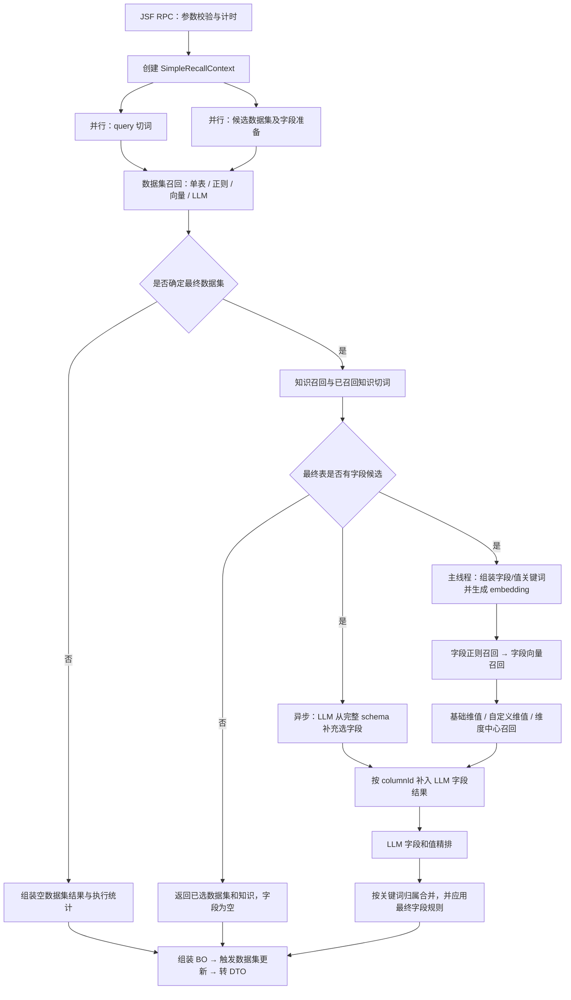

# `callBackDatasetFull` 完整流程解读

本文依据当前仓库中的实际调用关系，解释 `callBackDatasetFull` 从 JSF RPC 入口到最终 DTO 返回的完整执行过程。这个方法的定位是 Text-to-SQL 标准查询之前的完整召回服务：它从调用方给出的候选数据集中确定一张最终数据集，同时召回字段、维值和业务知识，再把结果作为 `recall_res` 交给后续标准查询链路；它本身不执行 SQL。

## 1. 方法定位与调用入口

仓库中与 `callBackDatasetFull` 直接相关的入口分为三层。`DataSetRagRpcService` 定义客户端契约，`DataSetRagRpcServiceImpl` 通过 `@BootService` 发布 JSF 服务并负责参数校验、异常封装和 DTO 转换，`DatasetCallBackService` 是领域门面，真正的召回编排位于 `SimpleCallDataSetExecutor.doCall`。

```text
DataSetRagRpcService.callBackDatasetFull
    ↓
DataSetRagRpcServiceImpl.callBackDatasetFull
    ↓
DatasetCallBackService.callBackDatasetFull
    ↓
SimpleCallDataSetExecutor.doCall
    ↓
SimpleCallDataSetExecutor.executeFull
    ↓
SimpleCallDataSetExecutor.makeFinalCall
    ↓
DataSetRagDTOConverter.convertCallBackDatasetBO
    ↓
ResponseDTO<CallBackDatasetFullFinalDTO>
```

对外入口见 `query-data-analysis-client/.../DataSetRagRpcService.java:9-15` 和 `query-data-analysis-app/.../DataSetRagRpcServiceImpl.java:24-64`。下游标准查询会把这份结果放入请求中的 `recall_res`，见 `query-data-analysis-app/.../ExecuteSqlRpcServiceImpl.java:251-263`。

## 2. 入参与返回值

`CallBackDatasetFullParam` 的字段用途如下。入口只把 `datasetIdList`、`query` 和 `erp` 作为必填项；`bookId` 与 token 上报上下文允许为空，但为空时会使依赖 book 语义配置的召回能力无法命中对应数据。

| 字段 | 必填性 | 在链路中的用途 |
| --- | --- | --- |
| `datasetIdList` | 必填且非空 | 候选数据集范围；元数据加载、选表和后置数据集更新都以它为输入 |
| `query` | 必填且非空 | LLM 切词、表名匹配、知识匹配、字段和值精排的原始问题 |
| `erp` | 必填且非空 | 数据集权限上下文、动态知识请求和后置数据集更新 |
| `bookId` | 可空 | 字段启停/别名/同义词、知识、自定义维值及召回阈值配置的 book 维度 |
| `tokenReportContext` | 可空 | 把 `traceId/nodeId/nodeType/groupId` 透传到每次 LLM token 上报 |

返回对象 `CallBackDatasetFullFinalDTO` 包含三部分：`callBackDatasetDTOS` 是最终数据集及其字段、维值；`knowledges` 是实际召回的知识；`callStatsDTO` 是各阶段耗时、总耗时以及字段和值召回使用的关键词。完整链路只会确定零张或一张最终数据集，正常选表成功时返回列表中只有一个元素。

入口校验直接访问 `callBackDatasetParam.get...()`，没有先判断参数对象本身是否为 `null`。因此参数对象为 `null` 时不是“必传参数缺失”，而是进入通用异常分支并返回“系统异常”。

## 3. 主流程总览



这条链路的核心运行态是 `SimpleRecallContext`。它把原始入参、候选数据集、最终数据集、切词结果、知识结果、字段结果、维值结果、最终合并结果和执行统计放在不同的子上下文中，各个 Stage 不直接互相返回业务对象，而是持续读写这一个上下文。

## 4. 详细执行过程

### 4.1 RPC 层校验、计时和异常封装

`DataSetRagRpcServiceImpl.callBackDatasetFull` 首先记录开始时间和完整入参，然后校验 `datasetIdList` 非空、`query` 非空白、`erp` 非空白。校验失败时直接返回 `PARAM_ERROR`，不会进入领域层。校验通过后调用 `DatasetCallBackService.callBackDatasetFull`，最后把领域 BO 转换为 DTO，并把从 RPC 入口开始计算的总耗时写入 `callStatsDTO.total`。

领域层抛出的 `BaseException` 会保留业务错误码、错误信息和扩展信息；其他异常统一转换为 `UNKNOW` 和“系统异常”。因此各 Stage 是否吞掉异常、是否降级，最终会直接决定调用方拿到成功空结果还是错误响应。

### 4.2 创建执行上下文

`SimpleCallDataSetExecutor.doCall` 创建 `SimpleRecallContext`，显式保存原始入参和 token 上报上下文，并初始化所有子上下文、缓存 Map、候选列表和 `CallExecutionStats`。token 上报信息直接放在 context 中而不是 ThreadLocal 中，因此后续 `CompletableFuture` 或线程池切换线程时仍然可以读取。

初始化完成后进入 `executeFull`。这个方法只负责阶段编排，最终由 `makeFinalCall` 把 context 中的状态转换成 `CallBackDatasetBO`。

### 4.3 query 切词与候选数据准备并行执行

`runSplitAndCandidatePrepare` 使用两个 `CompletableFuture.runAsync` 同时执行 `SplitQueryStage` 和 `DatasetPrepareStage`，随后通过 `allOf(...).join()` 等待二者结束。这里没有显式传入线程池，因此使用 `CompletableFuture` 的默认异步执行器。

切词侧不是只请求一次 LLM。`SimpleQuerySplit.split` 会并行发起两次相同的 `prompt.query.simpler-split` 调用，把两次结果的 `keywords` 和 `timeKeywords` 分别求并集，`dataSource` 优先取第一次非空结果对象中的值，再把时间词从普通关键词集合剔除。单次调用失败会被 `safeSimpleSplit` 吞掉；两次都失败或合并后没有关键词时，`SplitQueryStage` 直接把原始 query 整体作为一个关键词继续执行。切词成功后，如果模型给出了 `dataSource`，Stage 还会把它补入 `keywords`，避免模型把数据源单独抽走后导致后续字段和值召回丢词。

候选数据准备侧通过 `DataSetService.getDatasetDetailBatch(erp, datasetIdList)` 批量加载数据集详情。若 `bookId` 非空，还会读取 book 下的字段语义配置，并按候选数据集过滤。每张候选表的字段随后被转换为 `PrimaryCallColumnBO`：保留原字段元数据，合并字段启停状态、别名和同义词，识别聚合字段及维度绑定方式，并分别建立“候选表 → 字段列表”和“候选表 → columnId 索引”两份缓存。

字段启停只有在该数据集存在非空语义字段配置时才生效。此时 ifActive=false 字段会被候选集移除，比如用户手机号这种字段，不会展示给LLM去看；没有字段配置时，数据集 schema 中的字段默认全部参与召回。若 `aliasBlockOriginRecallEnabled` 开启，配置了别名的字段将不再用原字段名参与字段召回。

直接例子：调用方传入 `query=查询销售订单上月华东地区的销售额`、`bookId=9001`、`datasetIdList=[101,102]`。假设两次 LLM 切词结果合并后，系统先移除普通关键词中的时间词，再把 `dataSource` 补回关键词集合，最终得到：

```text
dataSource = 销售订单
keywords = {销售额, 华东地区, 销售订单}
timeKeywords = {上月}
```

与此同时，候选准备任务加载数据集 101“销售订单”和数据集 102“采购订单”。假设数据集 101 的原始字段是“地区、订单金额、下单日期、买家手机号”，book 9001 把“订单金额”配置了别名“销售额”，并停用了“买家手机号”；数据集 102 的字段是“供应商、采购金额、采购日期”。准备结束后，context 中一边保存了“用户要找销售订单、销售额、华东地区和上月”，另一边保存了两张候选表的有效字段，其中数据集 101 的字段候选为“地区、订单金额（别名：销售额）、下单日期”。这一步只完成“理解问题”和“准备可搜索范围”，还没有确定最终数据集。

### 4.4 确定最终数据集

`DatasetRecallStage.execute` 按“候选加载 → 字符串匹配 → 向量召回 → LLM 选表”的顺序逐层收窄。前一层已唯一确定最终数据集时，后面的层级不再执行。

| 层级 | 触发条件 | 实际规则 |
| --- | --- | --- |
| 单候选预选 | 加载后只有一张候选表 | 加载时先把该表设为最终表；当前 `execute` 仍会进入一次字符串匹配，随后因已有最终表而返回，不再执行向量和 LLM 选表 |
| 字符串匹配 | 仍有多张候选表 | 依次尝试 `dataSource` 与表名完全相等、表名出现在原始 query 中、`dataSource` 与表名互相包含；唯一命中时直接确定，多个命中时只收窄候选集 |
| 向量召回 | 字符串匹配未唯一确定 | 对 query 生成向量；若存在 `dataSource`，另用它生成表名向量；在 Vearch 中综合表名、描述和摘要得分 |
| LLM 选表 | 向量阶段仍未唯一确定且候选非空 | 把候选表 ID、名称、描述以及字段名/别名/同义词交给 `prompt.recall.simple-select-table` 选择最终 `tableId` |

向量阶段始终保留排序第一的候选，后续候选需要达到配置的最低分。只有一个向量候选且分数达到 `vectorFinalMinScore` 时直接确定；有多个候选时，如果第一名达到最低分，并且相对第二名的得分差达到 `vectorFinalDiffRatio`，也直接选择第一名。否则候选会裁剪到 `llmTableCandidateLimit` 后交给 LLM。

LLM 返回空选择或返回了候选集外的 `tableId` 时，代码回退到向量 top1；如果 LLM 调用本身经过重试后仍抛出异常，则不会回退，而是让异常终止整条请求。向量检索完全没有结果时，候选集被置空，不再调用 LLM，完整流程提前结束，最终返回成功响应但数据集列表为空。

最终表确定后，`bindFinalDatasetColumns` 从候选字段缓存中绑定这张表的正式字段上下文。如果最终表没有对应缓存，会抛出 `BaseException`。对于 Standard 或 `METRIC_DATASET` 类型的数据集，还会尝试加载并注册配置中的虚拟字段，使后续 LLM 选字段、字段精排和最终结果组装看到同一份字段候选。

直接例子：沿用上面的两个候选数据集，切词结果中的 `dataSource` 是“销售订单”。字符串匹配发现它与数据集 101 的名称完全相等，并且只命中这一张表，因此直接得到：

```text
最终数据集：
tableId = 101
tableName = 销售订单

正式字段候选：
地区
订单金额（别名：销售额）
下单日期
```

因为字符串匹配已经唯一确定数据集 101，本次请求不会继续执行数据集向量召回和 LLM 选表。数据集 102“采购订单”到这里被淘汰，不会参与后续知识、字段和值召回。这也说明 `datasetIdList=[101,102]` 在当前方法中表示“从两张候选表中选一张”，不是同时聚合两张表。

### 4.5 知识召回与知识关键词扩展

这一阶段主要解决一个问题：用户使用的是业务说法，但数据库字段名或字段值中并没有直接出现这种说法。

例如用户问：

```text
查询华东地区的销售额
```

数据库中可能没有“华东地区”这个字段，也没有值叫“华东地区”，实际存储的是：

```text
字段：province_name
字段值：上海、江苏、浙江、安徽
```

因此，系统需要先找到一条业务知识：

```text
华东地区包括上海、江苏、浙江、安徽
```

再把“上海、江苏、浙江、安徽”作为补充关键词，交给后续的字段召回或维值召回。整个过程可以理解为：

```text
确定最终数据集
    ↓
在该数据集配置的知识中寻找与 query 相关的知识
    ↓
返回命中的知识
    ↓
根据知识配置决定是否拆分知识解释
    ↓
把拆出的关键词加入字段召回或维值召回
```

需要注意，知识召回本身不会直接选择数据库字段，也不会直接返回某个维度值。它只是先找到相关的业务解释，再为后续召回提供更多关键词。

**为什么必须先确定最终数据集**

知识召回必须在最终数据集确定之后执行。系统只查询当前 `bookId + 最终 datasetId` 下配置的知识，不会把其他候选数据集的知识一起拿来匹配。

例如“销售订单表”和“库存仓库表”都可能配置“华东区域”相关知识，但含义不同：

```text
销售订单表：
华东地区包括上海、江苏、浙江、安徽

库存仓库表：
华东仓储区域包括上海仓、苏州仓、杭州仓
```

如果最终选择的是销售订单表，就只能使用销售订单表下的知识，不能把库存仓库表的知识混进来。`KnowledgeRecallStage` 会将 `bookId`、最终 `datasetId`、用户原始 query、用户 ERP 和 query 切分得到的关键词传给 `KnowledgeCallService`，再由它判断哪些知识与当前问题有关。

**知识是如何被召回的**

一条知识可以通过四种方式命中。前三种规则会逐一判断，同一条知识可能命中多条规则；向量召回只处理仍未命中的知识，最终结果按照 `knowledgeId` 去重。

| 命中方式 | 判断逻辑 | 作用 |
| --- | --- | --- |
| 始终召回 | 知识配置为 `ALL_TIME` | 查询该数据集时始终携带 |
| 知识词条命中 | query 包含知识的标准业务名称 | 用户直接说出了知识的正式名称 |
| 自定义关键词命中 | query 包含人为配置的触发关键词 | 用户使用了别名、简称或其他触发词 |
| 向量召回 | 对前三种方式未命中的知识进行语义相似度匹配 | 用户说法不同，但表达的意思相近 |

例如配置了一条知识：

```text
知识词条：高价值用户
自定义关键词：核心客户、重点客户、VIP客户
知识解释：近30天累计成交金额超过1万元的用户
```

用户问“查询高价值用户的销售额”时，因为 query 直接出现了标准名称“高价值用户”，所以属于知识词条命中；用户问“查询核心客户的销售额”时，因为“核心客户”是人为配置的触发关键词，所以属于自定义关键词命中。可以简单理解为：

```text
知识词条：这条知识正式叫什么
自定义关键词：用户还可能怎么称呼它，或者在什么场景下需要触发它
```

自定义关键词不一定是严格同义词，也可以只是触发词。例如：

```text
知识词条：大促期间统计口径
自定义关键词：618、双11、购物节
```

“618”不是“大促期间统计口径”的同义词，但用户提到“618”时，系统仍需要自动带出这条知识。

如果用户既没有说出标准词条，也没有命中自定义关键词，系统还可以通过向量相似度判断语义是否接近。例如知识词条是“高价值用户”，用户问“查询核心消费人群的销售贡献”，虽然文字不同，但语义可能接近，因此可以通过向量召回。

向量召回的相似度阈值和最多返回数量优先读取 `bookId + datasetId` 级别的配置；如果没有配置，则使用 DUCC 中的默认值。如果召回的是自定义动态知识，系统还会尝试调用动态知识接口获取最新解释文本；动态接口失败时只记录日志，不会中断整个召回流程。

**知识被召回后会发生什么**

知识被召回后，一定会进入最终返回结果中的 `knowledges`。但它是否继续影响字段召回和维值召回，要看 `useColumnCall` 和 `useValCall` 两个开关。

字段召回寻找的是数据集中的列，也就是用户的问题最终应该使用哪些字段，其中包括指标字段、维度字段和时间字段。例如：

```text
销售额
→ 召回指标字段 actual_pay_amount

省份、地区
→ 召回维度字段 province_name

下单时间、成交日期
→ 召回时间字段 order_date
```

可以把字段召回理解为：用户想查询哪一列、按照哪一列分组，或者使用哪一列进行过滤。

维值召回寻找的是维度字段中的具体取值，也就是某个维度字段应该过滤哪些值。例如：

```text
华东地区
→ 上海、江苏、浙江、安徽

核心会员
→ 钻石会员、PLUS会员

有效订单
→ 已完成、已签收
```

可以把维值召回理解为：已经知道要使用某个维度字段后，这个字段中具体应该筛选哪些值。两者的区别是：

| 召回类型 | 寻找的内容 | 示例 |
| --- | --- | --- |
| 字段召回 | 数据集中的列 | 销售额字段、省份字段、下单日期字段 |
| 维值召回 | 维度列中的具体值 | 上海、江苏、已完成、PLUS会员 |

对于“查询华东地区的销售额”，字段召回主要需要找到 `销售额 → actual_pay_amount` 和 `地区 → province_name`，维值召回则需要把“华东地区”落实为“上海、江苏、浙江、安徽”。最终 SQL 生成阶段才可能将两边结果组合为：

```sql
SELECT
    SUM(actual_pay_amount)
FROM
    sales_order
WHERE
    province_name IN (
        '上海',
        '江苏',
        '浙江',
        '安徽'
    );
```

其中 `actual_pay_amount` 和 `province_name` 来自字段召回，“上海、江苏、浙江、安徽”来自维值召回。

因此，`useColumnCall` 和 `useValCall` 实际控制的是：知识解释中的补充词，是用来帮助系统寻找字段，还是用来寻找字段中的具体值。

`useColumnCall=true` 表示把知识解释拆成关键词并加入字段召回。例如：

```text
知识词条：销售额
知识解释：销售额对应成交金额、实付金额

拆分结果：成交金额、实付金额
```

这些词更像字段名称，可以帮助系统找到 `actual_pay_amount`、`deal_amount` 等数据库字段。

`useValCall=true` 表示把知识解释拆成关键词并加入维值召回。例如：

```text
知识词条：华东地区
知识解释：华东地区包括上海、江苏、浙江、安徽

拆分结果：上海、江苏、浙江、安徽
```

这些词更像字段中的具体取值，可以帮助系统召回 `province_name` 字段中的上海、江苏、浙江和安徽。

两个开关的组合关系如下：

| 配置 | 实际效果 |
| --- | --- |
| `useColumnCall=false`，`useValCall=false` | 只返回知识，不扩展字段和值关键词 |
| `useColumnCall=true`，`useValCall=false` | 只扩展字段召回关键词 |
| `useColumnCall=false`，`useValCall=true` | 只扩展维值召回关键词 |
| `useColumnCall=true`，`useValCall=true` | 同时扩展字段和维值召回关键词 |

之所以不把所有补充词都同时加入两条链路，是因为不同知识解释中的词具有不同含义。“上海、江苏、浙江、安徽”明显是具体维度值，更适合维值召回；如果拿它们召回字段，可能得到“上海销售额”“江苏库存量”等无关字段。“成交金额、实付金额”则更像字段名称，更适合字段召回；如果拿它们召回维值，通常找不到有意义的具体值，还可能产生无关候选。

因此，可以按照下面的方式判断知识扩展方向：

```text
补充词描述的是“查哪一列”
→ 加入字段召回

补充词描述的是“这一列筛什么值”
→ 加入维值召回
```

有些知识解释同时包含字段和值信息，也可以同时打开两个开关。例如：

```text
知识词条：核心用户
知识解释：近30天成交金额超过1万元的会员用户
```

其中“成交金额、会员标识、成交日期”可以帮助寻找字段，“1万元、会员”也可能帮助确定过滤条件，因此可以同时配置 `useColumnCall=true` 和 `useValCall=true`。

这里拆分的是知识的解释文本，而不是简单地再次加入知识词条。对于“华东地区包括上海、江苏、浙江、安徽”，真正有价值的补充词是“上海、江苏、浙江、安徽”；“华东地区”本身通常已经出现在 query 中，没有必要重复加入。

**知识解释如何转换成关键词**

对于开启了 `useColumnCall` 或 `useValCall` 的知识，`SimpleKnowledgeSplit.splitBatch` 会并发切分知识解释。例如：

```text
华东地区包括上海、江苏、浙江、安徽
→ 上海、江苏、浙江、安徽
```

系统等待这些切分任务完成，最长等待时间由 `knowledgeSplitAwaitSeconds` 控制。随后，`initRecallKeywords` 会组装最终的召回关键词：query 本身切出的普通关键词默认同时进入字段召回和维值召回；知识解释拆出的关键词则根据 `useColumnCall` 和 `useValCall` 分别进入对应链路。

query 关键词同时进入两条链路，是因为在知识扩展前，系统还不一定能准确判断一个词表示字段还是字段值。例如“品牌”可能是在寻找品牌字段，“华为”可能是在寻找品牌字段中的具体值。知识扩展关键词来自人工配置的知识解释，可以通过两个开关明确指定用途，从而减少无关召回。

**完整示例**

假设用户提问：

```text
查询销售订单上月华东地区的销售额
```

系统已经确定最终数据集是：

```text
bookId = 9001
datasetId = 101
数据集：销售订单表
```

query 切词后得到：

```text
普通关键词：销售额、华东地区、销售订单
时间关键词：上月
```

数据集 101 下配置了一条知识：

```text
knowledgeId = 502
知识词条：华东地区
知识解释：华东地区包括上海、江苏、浙江、安徽
useColumnCall = false
useValCall = true
```

因为原始 query 直接出现了“华东地区”，所以这条知识通过知识词条命中，不需要依赖自定义关键词或向量召回。知识本身会进入最终返回结果，知识解释则被拆成“上海、江苏、浙江、安徽”。

由于 `useColumnCall=false`，这些补充词不会进入字段召回。字段召回仍主要根据“销售额、华东地区、销售订单”寻找 `actual_pay_amount`、`province_name` 等字段。由于 `useValCall=true`，拆出的省份会进入维值召回，用于寻找 `province_name` 等维度字段中的具体取值。最终形成：

```text
字段召回关键词：
销售额、华东地区、销售订单、上月

字段召回目标：
找到 actual_pay_amount、province_name 等字段

维值召回关键词：
销售额、华东地区、销售订单、上月、
上海、江苏、浙江、安徽

维值召回目标：
找到 province_name 字段中的上海、江苏、浙江、安徽等具体取值
```

后续字段召回可能得到：

```text
销售额 → actual_pay_amount
地区 → province_name
```

维值召回可能得到：

```text
上海、江苏、浙江、安徽
→ province_name 字段中的具体值
```

最终 SQL 生成阶段才可能把这些结果组合成：

```sql
SELECT
    SUM(actual_pay_amount)
FROM
    sales_order
WHERE
    province_name IN (
        '上海',
        '江苏',
        '浙江',
        '安徽'
    )
    AND dt BETWEEN 上月开始日期 AND 上月结束日期;
```

这条 SQL 不是知识召回直接生成的。知识召回只负责提供“华东地区对应上海、江苏、浙江、安徽”；字段召回负责确定“销售额使用 `actual_pay_amount`、地区使用 `province_name`”；维值召回负责确定 `province_name` 需要过滤哪些省份。最后由 SQL 生成阶段把字段和维值组合成完整查询。

**当前实现中的时间词问题**

query 切词阶段原本会将时间词单独放入 `timeKeywords`：

```text
普通关键词：销售额、华东地区、销售订单
时间关键词：上月
```

为了让“上月”也能参与知识匹配，`KnowledgeRecallStage` 会执行类似：

```java
keywords.addAll(timeKeywords);
```

“上月”在不同场景中的业务口径可能不同，例如可能表示上一个自然月，也可能表示从昨天向前计算的 30 天，因此需要通过业务知识补充具体定义。由于当前代码直接修改了原普通关键词集合，“上月”加入后还会继续进入字段召回和维值召回。

整体来看，知识召回与知识关键词扩展可以概括为：

```text
用户说出业务术语
    ↓
系统找到对应业务知识
    ↓
将知识解释转换成更具体的关键词
    ↓
字段召回使用相关关键词寻找数据集中的列
    ↓
维值召回使用相关关键词寻找维度列中的具体值
    ↓
SQL 生成阶段将字段和值组合成查询语句
```

它本质上是位于用户业务语言和数据库字段、字段值之间的一层翻译与补充机制。

### 4.6 LLM 补充选字段与主召回链交叠执行

先明确 4.6 之后的实际执行顺序。4.6、4.7、4.8 并不是严格按照章节编号串行执行：4.6 的 LLM 选字段任务会先被启动，但不会立刻等待它完成；主线程会同时准备关键词和向量，然后依次执行 4.7 字段召回、4.8 维值召回。主线程完成 4.8 后，才等待 4.6 的结果并汇合两条支线。汇合之后，4.9、4.10、4.11 才恢复为严格的顺序执行。

```text
4.5 知识召回与知识关键词扩展完成
        ↓
检查最终数据集是否存在字段候选
        ├─ 不存在
        │    → 跳过 4.6～4.10
        │    → 直接组装最终数据集和已召回知识，字段列表为空
        │
        └─ 存在
             ↓
        启动 4.6 LLM 补充选字段任务
             │
             ├──────────────────────────────┐
             │                              │
             │ 4.6 异步支线                 │ 主召回链
             │ 完整字段信息                 │ 初始化字段和值关键词
             │ + 原始 query                 │        ↓
             │ + 知识文本                   │ 创建两侧关键词 embedding
             │        ↓                     │        ↓
             │ LLM 选择可能需要的字段       │ 4.7 字段召回
             │        ↓                     │        ↓
             │ 映射回 columnId              │ 4.8 维值召回
             │                              │
             └──────────────────────────────┘
                            ↓
                 等待 4.6，并合并两侧字段结果
                            ↓
                 4.9 LLM 字段和值精排
                            ↓
                    4.10 最终规则合并
                            ↓
             4.11 组装结果、更新数据集并转 DTO
                            ↓
                       返回 RPC 响应
```

因此，可以先用一句话理解 4.6～4.11：4.6 是用 LLM 保底补字段，4.7 是根据关键词找字段，4.8 是根据关键词找字段中的具体值，4.9 是让 LLM 从已有候选中判断哪些值更相关，4.10 是把字段和值整理成最终结构并执行固定规则，4.11 才把这些结果组装成接口响应。这里仍然只是在准备查询所需的元数据，不会查询底表，也不会生成或执行 SQL。

4.6 主要解决的是：某个字段确实是回答问题所必需的，但字符串匹配和向量召回可能没有找到它。例如用户说“上月”，实际查询需要“下单日期”，这两个词在字面上并不相似，字段向量也不一定稳定命中，因此系统额外让 LLM 结合完整表结构判断应该使用哪些字段。

知识召回结束且最终表存在字段候选后，编排器通过 `CompletableFuture.supplyAsync` 启动 `ChooseColumnLLMStage`。该任务创建一份新的 `SimpleRecallContext`，但共享主 context 中已经准备好的字段信息和知识结果。它把最终表的完整字段名称、别名、同义词、虚拟字段枚举、原始 query 和知识文本交给 `prompt.query.simpler-columnChoose`。LLM 返回的是字段名称，系统再利用原名、别名和同义词索引将名称映射回真实的 columnId。

4.6 启动后，主线程同时初始化字段和值关键词，并分别为两侧创建关键词 embedding 缓存。字段和值即使拥有相同关键词，也会各调用一次 `createWordEmbeddingMap`，缓存只在各自链路内部复用。之后主线程先执行 `ColumnRecallStage`，再执行 `ValueRecallStage`。所以真正并行的是“4.6 LLM 补充选字段”和“关键词准备 + 4.7 字段召回 + 4.8 维值召回”这两条支线；4.7 和 4.8 本身仍是先后执行的。

主召回链完成后，系统通过 `future.join()` 等待 4.6。合并时以 4.7 已有的字段结果优先：某个 columnId 已经被字符串或向量召回时，该字段的 LLM 结果会被忽略；只有 4.7 完全没有该 columnId 时，才把 LLM 结果补进来。因此 4.6 的实际语义是“补充遗漏字段”，不是替代 4.7，也不是用 LLM 删除 4.7 已经找到的字段。

LLM 可以返回字段原名、别名或同义词，但映射回结果时，代码把 `callType` 强制设为 `ORIGIN`，字段文档中的名称也仍是原始中文字段名。因此这条补充路径不会保留“LLM 是通过哪个别名或同义词选中字段”的信息。

直接例子：最终数据集 101 有“地区、订单金额、下单日期”三个字段，用户问“查询销售订单上月华东地区的销售额”。4.6 看到完整 schema、原始 query 和知识后，判断查询“上月”需要日期字段，因此返回“订单金额、下单日期”。与此同时，4.7 通过字符串匹配找到了“地区”和“订单金额”，但没有把“上月”映射成“下单日期”。4.8 又找到了“地区”字段下的华东相关值。两条支线结束时，字段结果可以表示为：

```text
主字段召回结果：
地区
订单金额

LLM 选字段结果：
订单金额
下单日期

合并后的字段结果：
地区              ← 保留主召回结果
订单金额          ← 已存在，不被 LLM 覆盖
下单日期          ← 主召回缺失，由 LLM 补入
```

这个阶段最终输出的仍然是字段召回结果，只是其中可能增加由 LLM 补进来的字段。例子中的“下单日期”会交给 4.9 和 4.10 继续处理；4.6 本身不会生成“上月”的时间范围，也不会执行查询。

### 4.7 字段召回

4.7 只回答一个问题：字段侧的每个关键词，对应最终数据集中的哪一列。它不再选择数据集，也不判断某一列具体要筛选什么值。它的输入是 4.5 组装出的字段关键词、最终数据集的 active 字段，以及前面准备好的字段关键词 embedding；输出是按 columnId 保存的 `callColumnResult`。

`ColumnRecallStage` 先做确定性字符串匹配，再对没有匹配成功的关键词做向量召回。字符串索引包含每个 active 字段可用的原名、别名和同义词，判断顺序是：关键词与某个字段名称完全相同、关键词和字段名称互相包含、原始 query 中直接包含字段名称。这里的“字段名称”可能是原名，也可能是别名或同义词。

字符串命中后，系统以 1.0 分把结果写入 `callColumnResult`，同时从字段侧的剩余关键词中删除已经命中的关键词，避免再对同一个词做字段向量召回。这个删除只影响字段链，不会删除值链中的同名关键词。若系统使用原始 query 整句命中字段，还会把整句 query 登记为字段召回计划内关键词，保证 4.10 合并时不会把它当作计划外结果丢弃。

向量阶段只处理字符串阶段剩下的关键词，复用已经生成的 embedding，分别查询原始字段向量以及 book 下的字段别名、同义词向量。召回结果还会再通过最终数据集的 active 字段缓存校验，避免已停用或不属于最终表的字段混入结果。若某字段配置了别名并开启 `aliasBlockOriginRecallEnabled`，该字段的原名向量结果会被舍弃，优先要求通过别名语义命中。每条结果都会保留 columnId、实际命中的名称、名称类型、原关键词、分数和召回方式，供后续合并使用。

直接例子：字段侧关键词中有“销售额”和“华东地区”，字段候选中“订单金额”的别名是“销售额”，另一个字段名是“地区”。字符串匹配会得到：

```text
关键词“销售额”
→ 命中 columnId=102 的“订单金额”
→ 实际命中名称=销售额
→ 名称类型=ALIAS
→ score=1.0

关键词“华东地区”
→ 因为包含字段名“地区”，命中 columnId=101 的“地区”
→ 名称类型=ORIGIN
→ score=1.0
```

这两个关键词会从字段侧剩余集合中移除；“销售订单”和“上月”等没有完成字符串匹配的词才继续进入字段向量召回。最终，4.7 可能输出 `columnId=102` 的“订单金额”和 `columnId=101` 的“地区”。字段侧把“华东地区”识别为“地区”列，并不妨碍 4.8 继续独立判断“华东地区”是不是“地区”列中的具体取值。

### 4.8 维值召回

4.8 回答的是另一个问题：某个关键词如果表示具体业务值，它属于哪一个维度字段，底表实际应该使用什么值或编码。例如“地区”是字段，而“华东地区”是这个字段可能要筛选的值。4.8 不负责再次判断“销售额应该使用哪一列”，而是把“华东地区”这样的词绑定到“地区”列，并尽量得到底表可用的真实编码。

`ValueRecallStage` 的输入是值侧关键词、值关键词 embedding 和最终数据集字段信息。它先从最终表字段中筛出非虚拟的维度字段，再按数据集类型和字段的维度绑定方式决定去哪里查值。指标、日期等不承载枚举值的字段不会作为普通维值字段参与这一步，虚拟字段也只参与字段选择和最终透传，不进入维值召回。

| 字段类型 | 召回来源 |
| --- | --- |
| 普通数据集，`dimType` 为空或为 1 | Vearch 基础维值库 |
| 普通数据集，`dimType=2` 且存在 `dimCode` | 维度中心 |
| 普通数据集，`dimType=2` 但无 `dimCode` | 记为手工值替换字段，当前直接跳过 |
| Standard / `METRIC_DATASET`，字段描述为“维度” | 按 `customSql` 绑定维度中心 |
| book 下配置的自定义维值 | Vearch 自定义维值库 |

基础维值库和自定义维值库使用值侧 embedding 做语义查询；维度中心则按关键词并发查询。对于绑定了维度中心的自定义维值，如果自定义原值不是数字，代码还会继续调用维度中心做“自定义命中词 → 自定义原值 → 底表编码”的二次映射，只保留文本精确相等的映射结果。无论来自哪个来源，结果都必须能够落到最终数据集中的某个 columnId 上。

三类来源的结果会先按“关键词 + 来源 + columnId”分组过滤。低于最低阈值的结果被删除；达到高阈值的结果全部保留；如果组内没有达到高阈值的结果，就只保留达到最低阈值后的最高分并列项。数字关键词还要满足数值相等，例如 `1` 与 `1.0` 可以视为相等，但不能因为向量语义相近就把 `1` 召回成其他数字。

合并后的命中再用 active 字段缓存校验。命中了已禁用或不存在字段的维值不会进入业务结果，而是写入 `CallExecutionStats.suppressedValueRecalls` 供内部排查。基础维值或自定义维值的单关键词查询失败会被记录后继续其他关键词；维度中心单次失败也会降级为空结果，但前置 embedding 失败仍会终止完整请求。

基础维值和自定义维值循环还存在一个实际下标行为：embedding 下标只在当前关键词完整执行成功后递增。如果某个关键词抛出并被吞掉的 `BaseException`，后续关键词可能继续复用前一个下标对应的 embedding，造成关键词与向量错位。

直接例子：假设“地区”字段的 `columnId=101`、`dimType=2`、`dimCode=REGION`，因此它走维度中心召回；“订单金额”不是维度字段，所以不会承载“华东地区”这样的维值。维度中心收到关键词“华东地区”后返回：

```text
dimName = REGION
dimValue = 华东地区
dimCode = EAST
score = 0.95
```

这个结果达到当前阈值并且 `columnId=101` 仍是 active 字段，因此会写入：

```text
callValueResult：
columnId=101（地区）
  queryKeyword=华东地区
  dimValue=华东地区
  dimCode=EAST
  source=DIM_CENTER
  score=0.95
```

知识扩展出的“上海、江苏、浙江、安徽”也会分别尝试在相应的维度中查询。这个阶段输出的是 `columnId=101` 下的一组值命中，而不是把“华东地区”当成一列。这里最关键的结果是同时明确了“筛选哪一列”和“底表使用什么值”：字段是“地区”，展示值是“华东地区”，真实值是 `EAST`。

### 4.9 LLM 字段和值精排

4.9 容易和 4.6 混淆，但两者目的不同。4.6 面向最终数据集的完整字段列表，用来补充 4.7 可能遗漏的字段；4.9 面向 4.7 和 4.8 已经找出的候选字段、候选值，用来判断这些候选是否真的符合用户问题。简单地说，4.6 偏向“补漏”，4.9 偏向“从候选中降噪”。

`RerankMergeStage` 先把当前字段和值候选整理成“字段名称 + 枚举值列表”的 Markdown 表格，再把这张候选表、原始 query 和知识文本交给 `prompt.query.simpler-choose`。LLM 返回它认为需要的字段，以及每个字段需要保留的候选值。该 LLM 调用抛出 `BaseException` 或返回空列表时，当前 Stage 会直接跳过精排，4.7 和 4.8 的原始结果保持不变，流程仍会继续进入 4.10。

精排成功后，字段和值的实际处理并不对称。字段候选虽然会先按 LLM 返回的字段名过滤，但过滤结果随后又与精排前的原字段结果取并集，因此当前实现中 LLM 实际删不掉任何原字段。维值结果则会直接替换成 LLM 允许的枚举值集合，因此 LLM 可以真正删除它认为无关的值。还要注意，当前维值过滤只判断某个枚举文本是否出现在任意 LLM 返回项的 `columnValues` 中，并没有同时校验这个值是否属于 LLM 指定的字段名称。

`ChooseColumnLLMStage` 和 `RerankMergeStage` 构造知识文本时遍历的是 `fullKnowledgeCache`，不是只遍历 `recalledKnowledgeIds`。因此只要知识被加载进最终数据集的全量知识缓存，即使该知识没有被本次规则或向量链召回，也可能进入这两个 prompt 的知识文本。

直接例子：假设 4.7 与 4.8 汇总出的字段候选是“地区、订单金额、下单日期”，值候选是“地区=华东地区、上海、江苏、浙江、安徽”。LLM 判断当前问题只需要直接使用“华东地区”这一值，于是返回：

```text
地区 = [华东地区]
订单金额 = []
```

它没有返回“下单日期”，也没有允许“上海、江苏、浙江、安徽”。当前代码执行后的结果是：

```text
字段结果：地区、订单金额、下单日期
值结果：地区 = [华东地区]
```

“下单日期”仍然存在，是因为字段侧最终又与精排前结果取了并集；“上海、江苏、浙江、安徽”被删除，是因为值侧直接采用了 LLM 允许的集合。因此 4.9 的实际输出是“原字段结果基本保留、维值结果可以被缩减”，这些结果随后交给 4.10 做确定性的结构合并。

### 4.10 最终规则合并

4.10 不再调用 LLM，也不再去向量库查新候选。它的作用是把前面分散保存的“字段命中”和“值命中”整理成最终接口需要的“字段对象中包含维值”的结构，并在最后执行固定的字段收口规则。4.9 是语义判断，4.10 是确定性的归属、组装和补齐。

`RecallMergeStage` 先把原来按 columnId 保存的字段和值结果重组为“关键词 → 字段命中列表 + 值命中列表”，再结合这个关键词原本是否被安排进入字段召回和值召回，为每个关键词确定归属。由 4.6 LLM 补充的字段命中会被特殊视为字段计划内结果，避免因为它不是普通字段关键词而被丢弃。

| 关键词的实际命中情况 | 4.10 的处理 |
| --- | --- |
| 字段链和值链都有命中 | 字段和值都保留，记为 `COLUMN_AND_VALUE` |
| 只有字段链命中 | 只保留字段，记为 `COLUMN_ONLY` |
| 只有值链命中 | 保留值，并自动带出该值所属字段，记为 `VALUE_ONLY` |
| 两侧都没有命中，或属于计划外命中 | 丢弃，记为 `DROP` |

`FinalColumnAccumulator` 再把这些判断收敛到最终字段 Map。字段命中负责创建字段对象，并确定最终展示的字段名称以及它属于 `origin`、`alias` 还是 `synonym`；值命中会先保证值所属的字段对象存在，再把展示值 `enumValue`、底表真实值 `originEnumValue`、命中名称类型和分数写入该字段的 `fieldEnum`。如果同一个 columnId 通过不同字段名称或名称类型命中，当前结构可以保留多个字段变体；该 columnId 下的维值会同步到这些变体中，多次命中的字段分数取最高值。

按关键词合并完成后，还会执行三条固定的收口规则：FULL 表排除分区字段；所有日期类型字段即使没有被 query 命中也会自动补入；Standard 或 `METRIC_DATASET` 的 `alwaysRecall` 虚拟字段会自动补入。因此 4.10 产出的最终字段列表不一定只包含 4.7 命中的字段。

直接例子：沿用当前结果，“销售额”只在字段链命中“订单金额”，因此判定为 `COLUMN_ONLY`；“华东地区”既在字段链命中“地区”，又在值链命中“地区=华东地区”，因此判定为 `COLUMN_AND_VALUE`；“上月”如果两条链都没有命中，则判定为 `DROP`。合并结果为：

```text
订单金额
  实际命中名称=销售额
  名称类型=alias

地区
  fieldEnum=[华东地区 → EAST]
```

假设数据集 schema 中还有一个从未被关键词召回的 DATE 字段“支付日期”，最终收口仍会自动把它补入；4.6 补充的“下单日期”也会保留。如果该表同时是 FULL 表，并且分区字段是 `dt`，那么 `dt` 即使曾被召回也会被排除。4.10 最终交给 4.11 的字段因此可以是“订单金额、地区、下单日期、支付日期”，其中“地区”的 `fieldEnum` 包含“华东地区 → EAST”，但不会包含分区字段 `dt`。

### 4.11 结果组装、数据集更新与 DTO 转换

4.11 不再做召回判断，而是把 4.10 的最终字段 Map 转换成接口返回结构，并完成返回前的后置处理。`makeFinalCall` 会组装四类信息：最终数据集元数据、最终字段及其维值、本次真正召回的知识、各阶段执行统计。它不会再次扩充字段或值。

知识部分只把 `recalledKnowledgeIds` 对应的知识写入响应，不会返回 `fullKnowledgeCache` 中所有已加载知识。若存在最终数据集，则创建唯一的 `CallBackDatasetFullBO`，其中包含最终 datasetId、数据集名称和描述、字段列表等信息。数据集得分固定写为 `1.0`，不会透传前面选表时的向量得分；字段从 `finalCallColumnIds` 转为输出结构，维值继续保留展示词、真实值、名称类型和召回分数。

若前面的选表阶段没有得到最终数据集，`makeFinalCall` 仍会返回一个非空 `CallBackDatasetBO`，只是其中没有数据集结果。若已经确定数据集但没有字段候选，则返回这个数据集以及召回知识，字段列表为空。DTO 转换器会把空或 `null` 列表统一转换成空列表，因此调用方看到的是成功响应和 `callBackDatasetDTOS=[]` 或 `columns=[]`，而不是整个结果为 `null`。

领域门面在完整召回正常返回后，会遍历原始 `datasetIdList`，逐个调用 `DatasetAIEnableService.upsertDataset` 触发数据集向量元数据更新；这里更新的是全部候选数据集，不只是最终选中的数据集，单个更新异常只记录日志。方法使用 `this.triggerDataSetUpdate(...)` 调用带 `@Async("globalExecutor")` 的同类方法。按常见 Spring 代理机制，这种自调用不会经过异步代理，而且仓库内没有发现显式 `@EnableAsync`，因此仅从源码不能确认它在运行时一定异步。

触发数据集更新后，`DataSetRagDTOConverter` 将领域 BO 映射成 RPC DTO，空集合也在这里统一转换。RPC 层再把从入口到当前时刻的总耗时写入 `callStatsDTO.total`，最后包装为 `ResponseDTO.success` 返回。

直接例子：沿用上面的最终结果，转换后的响应主体可以简化为：

```yaml
callBackDatasetDTOS:
  - datasetId: 101
    datasetSchema:
      id: 101
      datasetCaption: 销售订单
      description: 销售订单明细数据
    score: 1.0
    columns:
      - columnId: 102
        columnNameCN: 订单金额
        originColumnName: 订单金额
        columnName: 销售额
        callColumnNameType: alias
        fieldEnum: []
      - columnId: 101
        columnNameCN: 地区
        originColumnName: 地区
        columnName: 地区
        callColumnNameType: origin
        fieldEnum:
          - enumValue: 华东地区
            originEnumValue: EAST
            callEnumValueType: synonym
      - columnId: 103
        columnNameCN: 下单日期
        originColumnName: 下单日期
        columnName: 下单日期
        callColumnNameType: origin
        fieldEnum: []
      - columnId: 104
        columnNameCN: 支付日期
        originColumnName: 支付日期
        columnName: 支付日期
        callColumnNameType: origin
        fieldEnum: []
knowledges:
  - knowledgeId: 502
    word: 华东地区
    explanation: 华东地区包括上海、江苏、浙江、安徽
callStatsDTO:
  total: 本次RPC总耗时
```

这里返回的是数据集元数据、召回字段、字段下的维值、知识和执行统计，不包含实际数据行，也不包含已经生成的 SQL。虽然最终只选中了数据集 101，但原始 `datasetIdList=[101,102]`，领域门面仍会分别触发 101 和 102 的 `upsertDataset`；之后 RPC 层完成 DTO 转换、补充总耗时并返回成功响应。至此，`callBackDatasetFull` 的完整召回流程结束，后续系统如果要真正查询数据，还需要再根据这些元数据生成并执行查询。

## 5. 提前返回、降级与失败边界

| 场景 | 当前行为 |
| --- | --- |
| 必填字段缺失 | RPC 层返回 `PARAM_ERROR` |
| 两次 query 切词均失败或无关键词 | 使用完整原始 query 作为唯一关键词继续召回 |
| 候选数据集详情为空，或表向量召回无结果 | 不再执行后续召回，返回成功响应和空数据集列表 |
| 最终表没有字段候选 | 保留最终数据集和已召回知识，字段列表为空，不再执行字段、值、精排和合并 |
| LLM 选表返回空对象或非法 tableId | 回退向量 top1 |
| LLM 选表调用最终失败 | 异常向上抛出，完整请求失败 |
| 异步 LLM 补充选字段失败 | `future.join()` 解包后向上抛出，完整请求失败 |
| LLM 字段和值精排失败或返回空结果 | 跳过精排，保留进入精排前的召回结果 |
| 动态知识、虚拟字段准备或维度中心单次调用失败 | 记录日志并继续主流程 |
| 字段 embedding、值 embedding、字段向量库或知识向量库发生不可降级异常 | 异常向上抛出，最终由 RPC 层转换为业务错误或系统错误 |
| 后置数据集更新失败 | 单个候选更新失败只记录日志，不影响已完成的召回响应 |

## 6. 并发与执行统计的实际范围

链路中共有多处并发：query 切词与候选数据准备并行；query 本身的两次 LLM 切词并行；已召回知识的解释切词使用业务线程池并发；LLM 补充选字段与主字段/值召回支线交叠执行；维度中心按关键词使用专用线程池并发。字段召回和值召回则是主线程中的顺序调用。

`StageExecutionSupport` 使用 `finally` 记录阶段耗时，因此 Stage 抛异常时也会留下该阶段统计。当前只有“大模型选表”显式向统计对象提供 LLM 调用耗时；切词、补充选字段和字段/值精排虽然调用了 LLM，但对应统计的 `llmCallTimeMs` 仍为 `null`。知识召回和两侧 embedding 准备也没有独立的 Stage 统计。补充选字段在新建的 context 中记录统计，结果合并回主 context 时没有合并该统计，因此最终响应通常看不到“大模型选字段”这一项；`RerankMergeStage` 和 `RecallMergeStage` 又都使用“召回结果合并”作为统计名称，调用方无法仅凭名称区分两步。

`suppressedValueRecalls` 只保留在领域统计对象中，DTO 转换器没有对外映射。虚拟字段标志也没有完整透传：领域字段对象虽然定义了 `virtualField`，但结果组装未赋值，最终 DTO 本身也没有对应字段。

## 7. 容易误读的当前实现

下面这些结论来自当前代码的实际赋值和调用顺序，而不是注释中的设计意图：时间词会在知识召回阶段被重新写回普通关键词集合；字段和值两条召回链当前是顺序执行；第一个 LLM 选字段阶段只补充缺失字段，第二个 LLM 精排阶段不能删除字段但能删除维值；两个字段相关 prompt 使用的是全量知识缓存；值召回判断 DSL 类型时读取的是原始 `datasetIdList.get(0)`，不是已经选出的最终 datasetId；单关键词维值召回失败后可能出现关键词与 embedding 下标错位；最终数据集对外分数固定为 `1.0`；后置 `@Async` 更新是否真正异步不能只凭注解确认。

这些行为会直接影响排查方式。例如响应里出现时间词参与字段召回，不应只检查切词 prompt；LLM 精排后字段没有减少，也不代表 prompt 一定返回了全部字段；多候选场景下若第一项数据集类型与最终表不同，值召回的 DSL 分流结果也可能与最终表元数据不一致。

## 8. 外部依赖与动态配置

| 依赖 | 在本方法中的职责 |
| --- | --- |
| EasyBI/JDP JSF | 按 ERP 和候选 ID 读取数据集详情、字段及数据源类型 |
| C-Side 语义服务 | 读取字段启停、别名、同义词、业务知识和 book+dataset 召回配置 |
| LLM HTTP | query/知识切词、多表选表、补充选字段、字段和值精排 |
| Embedding HTTP | 为 query 和字段/值关键词生成向量 |
| Vearch | 检索数据集、字段、字段别名/同义词、基础维值、自定义维值和知识 |
| 维度中心 | 查询绑定通用维度的真实业务值及编码 |
| 动态知识接口 | 为命中的自定义动态知识实时替换解释文本 |
| JDQ | 上报每次 LLM 成功或失败的 token 和调用上下文 |

表、字段、维值和知识的阈值、TopN、搜索窗口，LLM 模型、地址、重试次数，以及各线程池并发度主要由 DUCC 动态配置。`DataSetConfig`、`DataSetCallLLMConfig` 和 `ServiceConcurrencyConfig` 中的数值只是代码默认值，运行时应以 DUCC 实际值为准。四个主链路 prompt 的详细说明见同目录下的 `callback-dataset-full-prompt-analysis.md`。

## 9. 主要源码索引与验证现状

| 关注点 | 主要源码 |
| --- | --- |
| JSF 契约与入口 | `DataSetRagRpcService.java`、`DataSetRagRpcServiceImpl.java` |
| 领域门面与后置更新 | `DatasetCallBackService.java` |
| 主流程编排与结果组装 | `SimpleCallDataSetExecutor.java` |
| 运行上下文 | `SimpleRecallContext.java` |
| 切词与候选字段准备 | `SplitQueryStage.java`、`SimpleQuerySplit.java`、`DatasetPrepareStage.java` |
| 选表 | `DatasetRecallStage.java` |
| 知识召回 | `KnowledgeRecallStage.java`、`KnowledgeCallService.java`、`SimpleKnowledgeSplit.java` |
| 字段和值召回 | `ColumnRecallStage.java`、`ValueRecallStage.java`、`VectorCallService.java` |
| LLM 补字段与精排 | `ChooseColumnLLMStage.java`、`RerankMergeStage.java`、`LLMPromptInvoker.java` |
| 最终合并 | `RecallMergeStage.java`、`RecallMergeInputBuilder.java`、`KeywordMergeDecider.java`、`FinalColumnAccumulator.java` |
| DTO 转换 | `DataSetRagDTOConverter.java`、`CallBackDatasetFullFinalDTO.java` |

当前仓库没有覆盖 `callBackDatasetFull`、`SimpleCallDataSetExecutor` 或上述 Stage 的自动化测试；现有测试不能验证这条完整召回链。因此本文的流程结论来自静态调用链、上下文读写和分支条件核对，不代表已经通过端到端运行样例验证。
